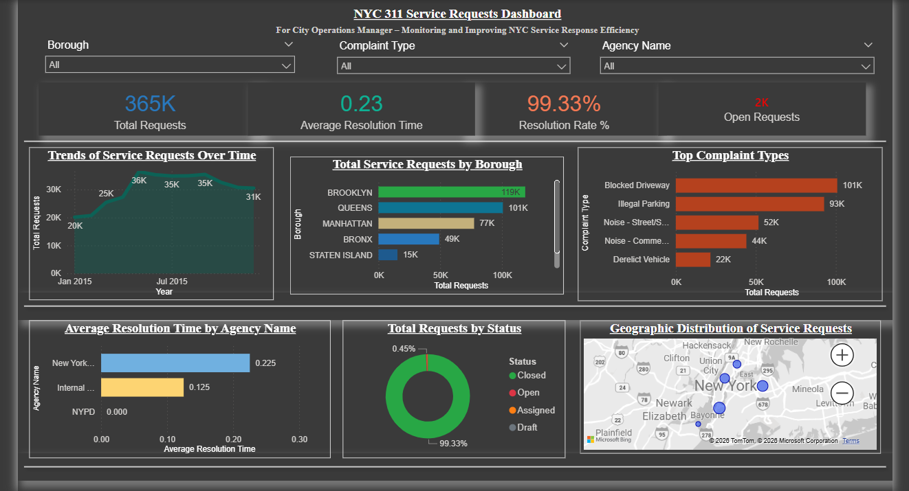

# 📊 NYC 311 Service Requests Analysis – Power BI Dashboard

An interactive **Power BI dashboard** developed to analyse NYC 311 service request data and provide insights into request volumes, complaint categories, geographic distribution, agency performance, resolution time, and request status.

This project demonstrates the use of **Power BI for data analysis, KPI development, interactive dashboard design, geographic visualisation, and communicating insights from a large real-world service-request dataset**.

> 🎓 Developed as part of postgraduate Business Analytics coursework at Dublin Business School.

---

## 📌 Project Overview

NYC 311 provides residents with a centralised service for reporting non-emergency issues and requesting information about city services.

Large volumes of service-request data can make it difficult to quickly understand:

- How many requests are being received
- Which complaint types occur most frequently
- Which boroughs generate the highest request volumes
- How service requests change over time
- How quickly agencies resolve requests
- How many requests remain open or have been closed
- Where requests are geographically concentrated

This project uses **Power BI** to transform the NYC 311 service-request data into an interactive analytical dashboard that makes these patterns easier to explore and understand.

---

## 🎯 Project Objective

The objective of the project was to create an interactive dashboard capable of presenting important operational information from NYC 311 service requests in a clear and accessible format.

The analysis focuses on:

- Overall service-request volume
- Resolution performance
- Open and closed requests
- Complaint categories
- Borough-level request distribution
- Agency-level resolution performance
- Request trends over time
- Geographic distribution of service requests

---

## 🗂️ Dataset

The project uses an **NYC 311 Service Request dataset** containing detailed information about individual service requests.

The dataset includes fields related to areas such as:

- Request creation date
- Request closure date
- Agency
- Agency name
- Complaint type
- Complaint description
- Request status
- Borough
- City
- Resolution description
- Latitude
- Longitude

These attributes enable the service requests to be analysed from temporal, operational, categorical, and geographic perspectives.

### 📥 Dataset

> **Dataset Note:** The full NYC 311 dataset used for this analysis is approximately 215 MB and is not included in this repository due to GitHub's file-size limits. The repository contains the Power BI project, dashboard export, and visual documentation of the analysis.

---

## 📊 Dashboard

The Power BI dashboard brings multiple analytical views together into a single interactive report.

### Dashboard Preview



### 🔗 Dashboard Files

- **[Download / View Power BI File](./dashboard/nyc-311-service-requests-dashboard.pbix)**
- **[View Dashboard PDF](./dashboard/nyc-311-service-requests-dashboard.pdf)**

---

## 📈 Key Performance Indicators

The dashboard highlights four headline KPIs.

| KPI | Dashboard Result |
|---|---:|
| 📩 Total Requests | **365K** |
| ⏱️ Average Resolution Time | **0.23** |
| ✅ Resolution Rate | **99.33%** |
| 📂 Open Requests | **~2K** |

These indicators provide a high-level overview of service-request activity and resolution performance.

---

## 🔍 Dashboard Analysis

### 📅 Requests Over Time

The dashboard includes a time-series visualisation showing how the volume of NYC 311 service requests changes over time.

This helps identify:

- Changes in request volume
- Periods of increased service demand
- General request patterns over the analysed period

---

### 🏙️ Requests by Borough

Service requests are compared across NYC boroughs, allowing differences in request volume between geographic areas to be identified.

The dashboard includes borough-level analysis for areas including:

- Brooklyn
- Queens
- Manhattan
- Bronx
- Staten Island

This provides a quick comparison of where service requests are most concentrated.

---

### 📋 Top Complaint Types

The dashboard analyses service requests according to **Complaint Type**.

This allows frequently reported issues to be identified and compared, helping users understand which categories contribute most heavily to overall 311 demand.

---

### 🏢 Resolution Time by Agency

Agency-level analysis is included to compare the average time associated with resolving service requests.

This provides an operational view of how resolution performance differs across agencies represented in the dataset.

---

### ✅ Request Status

The dashboard provides a breakdown of requests according to their status.

This makes it possible to understand the proportion of requests that have been resolved compared with those that remain open or have another status.

---

### 🗺️ Geographic Distribution

Latitude and longitude information from the dataset is used to visualise the geographic distribution of service requests.

The map provides an intuitive way to identify areas where requests are concentrated and adds a spatial perspective to the analysis.

---

## 🎛️ Interactive Filters

The dashboard includes interactive filters that allow users to explore the data dynamically.

Available filters include:

- **Borough**
- **Complaint Type**
- **Agency Name**

These filters allow users to move from the overall city-level picture to more specific subsets of the service-request data.

For example, users can focus on a particular borough and then examine the associated complaint types, agencies, request volumes, and resolution performance.

---

## 🧠 Analytical Approach

The project follows a typical Business Intelligence workflow:

```text
NYC 311 Dataset
       ↓
Data Preparation
       ↓
Power BI Data Model
       ↓
KPI Development
       ↓
Service Request Analysis
       ↓
Interactive Visualisations
       ↓
Dashboard Development
       ↓
Insights & Communication
```

The final dashboard combines summary KPIs with categorical, temporal, operational, and geographic analysis.

---

## 💡 Key Insights

The dashboard enables several important observations from the analysed service-request data.

### 1. High Overall Request Volume

The analysed dataset contains approximately **365K service requests**, demonstrating the significant volume of interactions handled through NYC 311.

### 2. High Resolution Rate

The dashboard reports a **99.33% resolution rate**, indicating that the large majority of requests represented in the analysed data were resolved.

### 3. Relatively Small Open-Request Volume

Approximately **2K requests** are displayed as open compared with the overall service-request volume.

### 4. Service Demand Varies Geographically

The borough and map visualisations demonstrate that service requests are not distributed uniformly across geographic areas.

### 5. Complaint Categories Differ in Volume

Complaint-type analysis shows that certain categories account for considerably more service requests than others.

### 6. Agency Performance Can Be Compared

The agency resolution-time visualisation allows operational differences between agencies to be explored.

### 7. Service Requests Change Over Time

The time-series analysis makes changes in service-request activity visible across the analysed period.

---

## 🛠️ Tools & Technologies

| Tool / Technology | Purpose |
|---|---|
| **Power BI Desktop** | Data analysis and dashboard development |
| **Power Query** | Data preparation within the Power BI workflow |
| **DAX / Measures** | KPI and analytical calculations |
| **CSV** | Source dataset format |
| **Power BI Visualisations** | Analytical presentation |
| **Map Visualisation** | Geographic service-request analysis |
| **Git & GitHub** | Project documentation and portfolio presentation |

---

## 📁 Repository Structure

```text
nyc-311-service-requests-power-bi/
│
├── dashboard/
│   ├── nyc-311-service-requests-dashboard.pbix
│   └── nyc-311-service-requests-dashboard.pdf
│
├── data/
│   └── Dataset excluded from repository due to file size
│
├── screenshots/
│   └── nyc-311-service-requests-dashboard.png
│
└── README.md
```

---

## 🔗 Explore the Project

| Resource | Link |
|---|---|
| 📊 Power BI Dashboard | **[Open PBIX File](./dashboard/nyc-311-service-requests-dashboard.pbix)** |
| 📄 Dashboard PDF | **[View PDF](./dashboard/nyc-311-service-requests-dashboard.pdf)** |
| 🖼️ Dashboard Preview | **[View Screenshot](./screenshots/nyc-311-service-requests-dashboard.png)** |

---

## 🎯 Skills Demonstrated

This project demonstrates practical experience in:

- Power BI dashboard development
- Business Intelligence
- Data analysis
- KPI development
- Data visualisation
- Data preparation
- Interactive filtering
- Time-series analysis
- Geographic analysis
- Categorical analysis
- Operational performance analysis
- Translating raw data into understandable insights
- Communicating analytical findings through dashboards

---

## 📌 Business Analytics Relevance

Although NYC 311 is a public-service dataset, the analytical techniques demonstrated in this project are transferable to many business environments.

The same approach can be applied to areas such as:

- Customer service analytics
- Support-ticket analysis
- Complaint management
- Service operations
- SLA monitoring
- Customer experience analysis
- Operational performance reporting

The project therefore demonstrates how large volumes of service data can be converted into meaningful performance indicators and visual insights for decision-making.

---

## ⚠️ Project Scope

This dashboard was developed as an **academic Business Analytics project**.

The results represent the data contained within the project dataset and should therefore be interpreted within that analytical scope rather than as a representation of all current NYC 311 activity.

The project focuses primarily on demonstrating:

- Analytical thinking
- Power BI development
- KPI reporting
- Data visualisation
- Interactive analysis
- Business Intelligence communication

---

## 🔮 Potential Enhancements

Possible future improvements include:

- Additional drill-through analysis
- More detailed agency performance metrics
- Complaint-resolution trend analysis
- Service-level performance indicators
- Additional time-based comparisons
- Enhanced geographic analysis
- More detailed resolution-time segmentation
- Dynamic tooltips and navigation
- Additional executive-level KPI views
- Automated data refresh using an appropriate live data source

---

## 🧠 Key Learnings

Through this project, I gained practical experience in working with a large service-request dataset and converting raw records into an interactive analytical dashboard.

The project strengthened my understanding of:

- Structuring an analytics problem
- Selecting meaningful KPIs
- Designing dashboards for quick interpretation
- Analysing service operations
- Comparing categorical and geographic patterns
- Presenting large datasets visually
- Using interactive filters for deeper analysis
- Communicating analytical results clearly

It also reinforced the importance of designing dashboards around the **questions users need to answer**, rather than simply displaying available data.

---

## 👩‍💻 Author

### Varsha Sundararaj

**MSc Business Analytics**  
Dublin Business School, Ireland

Former **Product Support Technical Advisor – IQVIA**

Aspiring **Data Analyst | Business Analyst**

### 🔗 Connect

- 💼 **LinkedIn:** [Varsha Sundararaj](https://www.linkedin.com/in/varsha-sundararaj-40a463201)
- 💻 **GitHub:** [varshasundararaj-analytics](https://github.com/varshasundararaj-analytics)

---

## ⭐ Portfolio Note

This project forms part of my Business Analytics portfolio and demonstrates the ability to transform a large service-request dataset into an **interactive Power BI dashboard containing operational KPIs, trend analysis, geographic analysis, complaint analysis, and service-performance insights**.

It particularly demonstrates skills relevant to **Data Analyst, Business Analyst, Business Intelligence, and reporting-focused roles**.